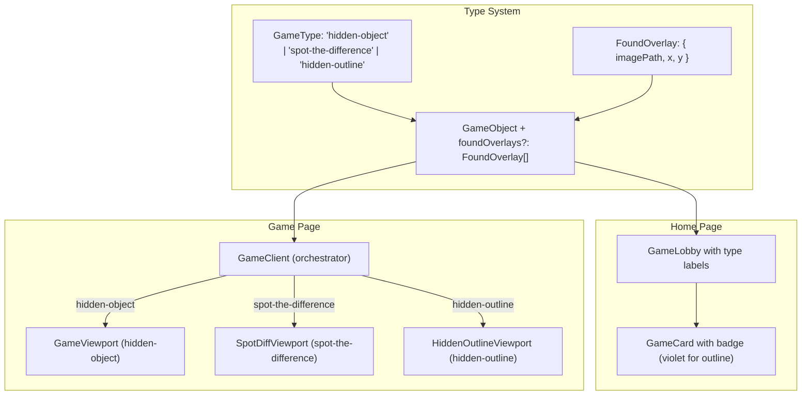

# Hidden Outline Game Implementation Plan

## Overview

Hidden Outline is the third game type in the Visual Puzzle Games platform. Players search a scene for camouflaged objects. When they click the correct area, a pre-made overlay image appears on top of the base image, revealing the hidden object with a visible outline or highlight.

This document covers how Hidden Outline works, how it differs from the existing Hidden Object game, and the design decisions behind it.

---

## How Hidden Object Works (Existing)

The original hidden-object game uses a **mask-based** system:

1. A single background image contains the full scene.
2. Each hidden object has a **mask image** — a full-canvas-sized PNG with transparency everywhere except the object's silhouette.
3. On load, all masks are drawn to an offscreen canvas scaled to the background dimensions, and their pixel data (`ImageData`) is extracted.
4. **Click detection**: When the player clicks, screen coordinates are converted to image space (`imageX = canvasX / scale`). The alpha channel of each unfound mask is sampled at that pixel. If alpha > 0, it's a hit.
5. **Found state rendering**: A `Path2D` is built from all non-transparent pixels in the mask and filled with a semi-transparent green overlay (`rgba(0, 255, 0, 0.5)`).
6. **Animation**: The mask image animates from the object's center to the corresponding badge in the object list.

Key files:
- `hooks/canvas/use-mask-loader.ts` — loads masks as full-canvas `ImageData`
- `hooks/canvas/use-click-detector.ts` — samples mask alpha at click coordinates
- `lib/canvas/renderer.ts` — builds `Path2D` from mask pixels and fills with color
- `components/game/game-viewport.tsx` — renders background image + canvas overlay

---

## How Hidden Outline Works (New)

Hidden Outline replaces the mask + green overlay system with **positioned overlay images** that serve as both the click target and the visual reveal.

### Key Differences from Hidden Object

| Aspect | Hidden Object | Hidden Outline |
|--------|---------------|----------------|
| Found visual | Green semi-transparent fill | Pre-made overlay image composited on scene |
| Mask images | Full-canvas PNGs, one per object | Smaller cropped PNGs with x,y position, multiple per object |
| Click detection | Sample alpha on full-canvas mask | Sample alpha on positioned overlay image at `(clickX - overlay.x, clickY - overlay.y)` |
| Data model | `maskPath` on `GameObject` | `foundOverlays` array on `GameObject` |
| Rendering | `Path2D` pixel fill | `ctx.drawImage()` at overlay position |

### Data Model

```typescript
export interface FoundOverlay {
  imagePath: string; // Path to the cropped overlay PNG (transparent background)
  x: number;         // X position on the base image (in image-space pixels)
  y: number;         // Y position on the base image (in image-space pixels)
}

export interface GameObject {
  id: string;
  name: string;
  description?: string;
  maskPath: string;             // Still required for other game types
  foundOverlays?: FoundOverlay[]; // For hidden-outline: positioned overlay images
}
```

Each hidden object can have **multiple overlay images** (e.g., a cat might have separate overlays for its body and tail). All overlays for an object share the same `id` — clicking any one of them finds the whole object, and all of them appear when found.

### Pipeline

```
Game Load
  │
  ▼
useOutlineLoader
  ├─ For each object's foundOverlays:
  │   ├─ Load image
  │   ├─ Extract ImageData (at native size, NOT scaled to canvas)
  │   └─ Store: { overlay, imageData, image, width, height }
  └─ Return: Map<objectId, LoadedOverlay[]>
  │
  ▼
useHiddenOutlineCanvas
  ├─ Rendering (on foundObjects change):
  │   ├─ Clear canvas
  │   └─ For each found object's overlays:
  │       └─ ctx.drawImage(image, overlay.x, overlay.y)
  │
  └─ Click Detection:
      ├─ Convert screen coords to image space (÷ scale)
      ├─ For each unfound object:
      │   └─ For each overlay:
      │       ├─ localX = imageX - overlay.x
      │       ├─ localY = imageY - overlay.y
      │       ├─ Bounds check against overlay dimensions
      │       └─ Sample alpha at (localY * width + localX) * 4 + 3
      └─ Return ClickResult on hit, null on miss
```

### Design Decisions

**Why use overlay images for click detection instead of separate masks?**
The overlay images already define exactly where the hidden object is (non-transparent pixels = the object). Using them for both rendering and hit detection eliminates redundancy — no need to create and maintain separate mask files.

**Why support multiple overlays per object?**
A single hidden object might span disconnected visual regions (e.g., a snake weaving behind scenery). Multiple overlays allow any visible part to be clickable while keeping them grouped as one logical object.

**Why are overlays positioned with x,y instead of being full-canvas images?**
Cropped images are smaller and faster to load. With under 10 hidden objects and a few overlays each, the overhead is minimal. The x,y coordinates map directly to image-space pixels, matching the coordinate system used throughout the rest of the canvas pipeline.

**Why a separate viewport instead of modifying GameViewport?**
The rendering logic is fundamentally different (compositing images vs. filling Path2D shapes), and the data loading is different (positioned overlays vs. full-canvas masks). A separate viewport keeps each game type self-contained without conditional branching in shared code.

---

## Architecture



## Files Modified

| File | Change |
|------|--------|
| `types/game.ts` | Added `FoundOverlay` interface, `'hidden-outline'` to `GameType`, `foundOverlays` to `GameObject` |
| `components/game-lobby.tsx` | Added hidden-outline entry to `gameTypeLabels` (Shapes icon, violet badge) |
| `components/game/index.tsx` | Route `hidden-outline` to `HiddenOutlineViewport` |
| `app/globals.css` | Added `.game-type-badge-outline` style |

## New Files Created

| File | Purpose |
|------|---------|
| `components/game/hidden-outline-viewport.tsx` | Viewport: renders base image + canvas for overlay compositing and click detection |
| `components/game/hidden-outline-debug.tsx` | Debug panel: overlay bounds, hit pixel visualization, per-object toggles |
| `hooks/canvas/use-outline-loader.ts` | Loads overlay images and extracts `ImageData` for hit testing |
| `hooks/use-hidden-outline-canvas.ts` | Orchestrates rendering and click detection for hidden-outline games |
| `lib/games/hidden-outline-test.ts` | Test game config (placeholder for manual asset/coordinate entry) |

## What Stays the Same

- Timer, scoring, and game state hooks (`use-game-state.ts`, `use-found-objects.ts`)
- Object list UI and progress bar
- Game start modal and game completion modal
- Canvas size calculation (`use-canvas-size.ts`)
- Lobby card layout (single image preview, same as hidden-object)
- Game configuration structure (objects array, difficulty, timeLimit, etc.)

---

## Creating a New Hidden Outline Game

1. Prepare a base image containing the full scene with objects camouflaged.
2. For each hidden object, create one or more cropped overlay PNGs with transparent backgrounds. These should show the object with a visible outline or highlight, sized and positioned to align with the base image.
3. Create a game config file:

```typescript
import { Game } from '@/types/game';

export const myOutlineGame: Game = {
  id: 'my-outline-game',
  title: 'My Game',
  description: 'Find the hidden objects!',
  type: 'hidden-outline',
  backgroundPath: '/static/my-game/scene.png',
  difficulty: 'medium',
  timeLimit: 180,
  objects: [
    {
      id: 'cat',
      name: 'Hidden Cat',
      maskPath: '', // Not used for hidden-outline, but required by interface
      foundOverlays: [
        { imagePath: '/static/my-game/cat-body.png', x: 120, y: 340 },
        { imagePath: '/static/my-game/cat-tail.png', x: 95, y: 410 },
      ],
    },
    {
      id: 'key',
      name: 'Golden Key',
      maskPath: '',
      foundOverlays: [
        { imagePath: '/static/my-game/key.png', x: 500, y: 200 },
      ],
    },
  ],
};
```

4. Add the game to `lib/games/index.ts`.

---

## Debug Mode

Append `?debug` to any hidden-outline game URL to enable the debug panel:

```
http://localhost:3000/game/hidden-outline-test?debug
```

The debug panel (rendered in `components/game/hidden-outline-debug.tsx`) provides:

- **Bounds** — color-coded bounding boxes for each overlay, labeled with `[widthxheight]` and `% opaque`. If an overlay shows 100% opaque, the image lacks transparency and will register as clickable everywhere within its bounds.
- **Hit pixels** — renders the actual non-transparent pixels (the clickable area) as a colored overlay on the scene, so you can see exactly what the hit detection sees.
- **Per-object toggles** — show/hide debug visualization for individual objects.

This is useful for diagnosing:
- Overlay images that lack proper transparency (solid background instead of transparent)
- Misaligned x,y coordinates
- Overlapping hit areas between objects

### Asset Requirements

Overlay PNGs **must** have a transparent background. The non-transparent pixels define both the visual reveal and the clickable area. The image's natural width and height are read at load time — only `x` and `y` need to be specified in the config. These represent the top-left corner position on the base image in image-space pixels.
