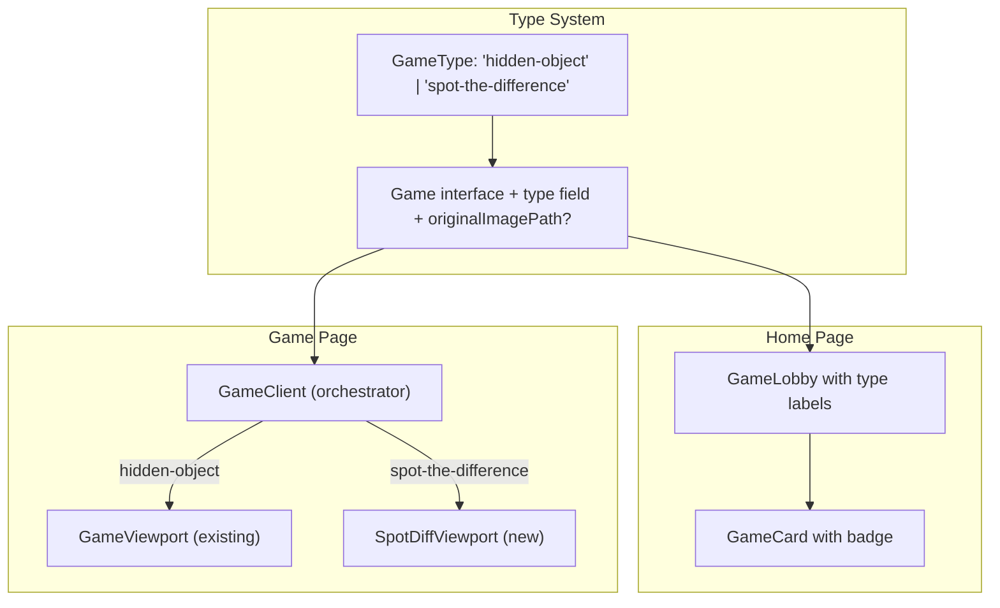

# Spot the Difference Game Implementation Plan

## Architecture Overview



## Files Modified

| File | Change |
|------|--------|
| `types/game.ts` | Added `GameType` and `type` + `originalImagePath` fields |
| `components/game-lobby.tsx` | Added game type badge to cards |
| `components/game/index.tsx` | Conditionally render viewport based on game type |
| `lib/games/*.ts` | Added `type: 'hidden-object'` to existing games |
| `app/globals.css` | Added CSS for game type badge and spot-diff layout |

## New Files Created

| File | Purpose |
|------|---------|
| `components/game/spot-diff-viewport.tsx` | Dual-panel viewport with original (static) and gameplay (interactive) images |
| `lib/games/spot-diff-example.ts` | Example spot-the-difference game config |

## Implementation Details

### 1. Type System Changes

Extended `types/game.ts` with:

```typescript
export type GameType = 'hidden-object' | 'spot-the-difference';

export interface Game {
  // existing fields...
  type: GameType;
  originalImagePath?: string; // Required for spot-the-difference
}
```

### 2. Home Page Labels

Updated `components/game-lobby.tsx` `GameCard` to show a badge indicating game type ("Hidden Object" or "Spot the Difference").

### 3. Spot the Difference Viewport

Created `components/game/spot-diff-viewport.tsx` with:
- Two side-by-side panels (responsive: stacked on mobile, horizontal on desktop)
- Left panel: `originalImagePath` (static, non-interactive)
- Right panel: `backgroundPath` + `GameCanvas` (interactive, uses existing mask detection)
- Both panels share the same canvas size calculation for alignment

### 4. Conditional Rendering

Updated `components/game/index.tsx` to:
- Check `game.type`
- Render `GameViewport` for hidden-object games (existing behavior)
- Render `SpotDiffViewport` for spot-the-difference games

### 5. CSS Updates

Added styles to `app/globals.css` for:
- `.game-type-badge`: Badge on game cards showing game type
- `.spot-diff-container`: Flexbox container for dual panels
- `.spot-diff-panel`: Individual panel styling with gradient background
- `.spot-diff-label`: "Original" / "Find Differences" labels
- `.spot-diff-image-container` and `.spot-diff-canvas`: Image positioning

## What Stays the Same

- Timer, scoring, and game state hooks
- Object list UI at top
- Mask loading and click detection logic
- Found object animation
- Game completion modal
- Game configuration structure (objects array with maskPath)

## Creating a New Spot-the-Difference Game

To create a new spot-the-difference game:

1. Create two images: the original and the modified version with differences
2. Create mask images for each difference (same process as hidden object masks)
3. Create a game config file:

```typescript
import { Game } from '@/types/game';

export const mySpotDiffGame: Game = {
  id: 'my-spot-diff',
  title: 'My Game',
  description: 'Find the differences!',
  type: 'spot-the-difference',
  originalImagePath: '/static/my-game/original.png',
  backgroundPath: '/static/my-game/modified.png',
  difficulty: 'medium',
  timeLimit: 120,
  objects: [
    {
      id: 'diff-1',
      name: 'Changed Item',
      maskPath: '/static/my-game/diff-1-mask.png'
    },
    // ... more differences
  ]
};
```

4. Add the game to `lib/games/index.ts`

